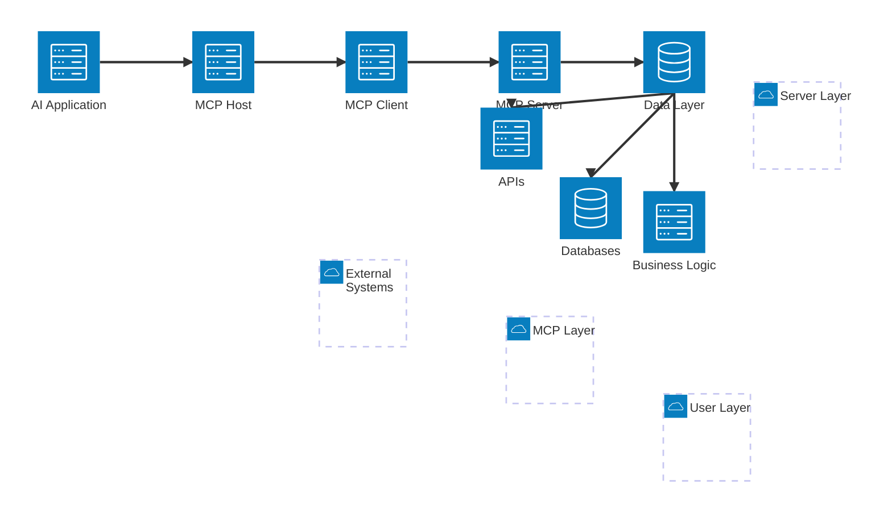
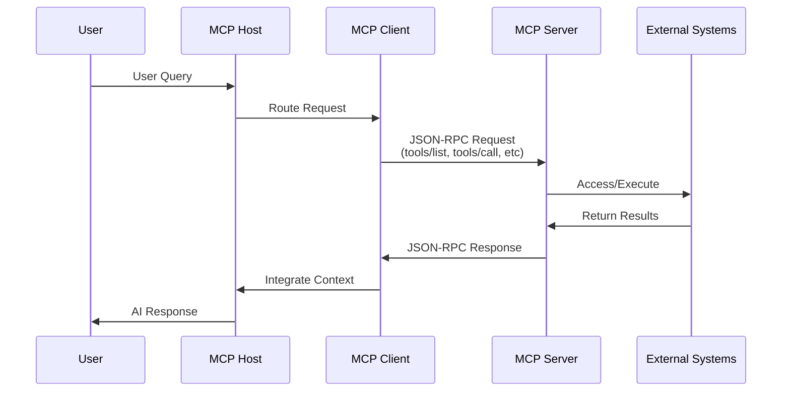
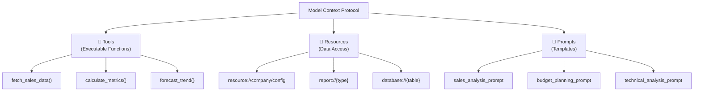
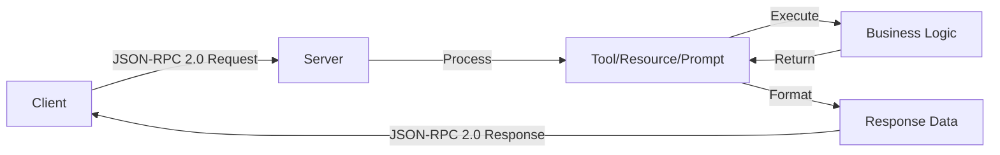
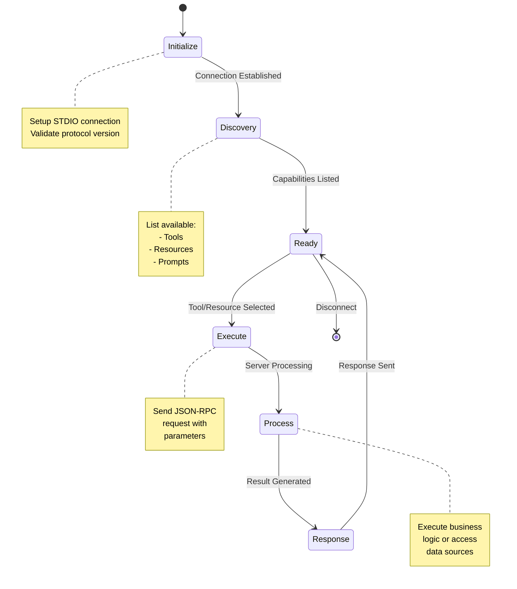

# Python MCP Server-Client Implementation

A comprehensive example of the **Model Context Protocol (MCP)** demonstrating how to build production-ready MCP servers and clients in Python.

## 📋 Overview

This project demonstrates:

- **MCP Server**: A complete FastMCP server with tools, resources, and prompts
- **MCP Client**: An asynchronous client for connecting to and interacting with MCP servers
- **Integration**: Practical examples of client-server communication patterns

## 🏗️ Architecture

### System Architecture Diagram



### Data Flow Diagram



### Capability Architecture



### Communication Protocol



### Protocol State Machine



## 📁 Project Structure

```
mcp-python-demo/
├── server.py              # FastMCP Server implementation
├── client.py              # MCP Client implementation
├── examples.py            # 6 Real-world usage examples
├── ai_integration.py      # AI model integration examples
├── .env                   # AI configuration template
├── requirements.txt       # Python dependencies
├── README.md             # This file (with merged quick start)
```

## 🚀 Quick Start Guide

### Step 1: Installation

#### A. Create Project Directory

```bash
mkdir mcp-python-demo
cd mcp-python-demo
```

#### B. Create Virtual Environment

**macOS/Linux:**
```bash
python3 -m venv venv
source venv/bin/activate
```

**Windows:**
```bash
python -m venv venv
venv\Scripts\activate
```

#### C. Install Dependencies

```bash
pip install -r requirements.txt
```

This installs:
- `mcp>=0.6.0` - Core MCP protocol
- `fastmcp>=0.8.0` - Server framework
- `pytest` - Testing framework
- And all other dependencies

### Step 2: Verify Project Structure

After installation, your directory should contain:

```
mcp-python-demo/
├── venv/                    # Virtual environment
├── server.py               # MCP Server
├── client.py               # MCP Client
├── examples.py             # Usage Examples
├── requirements.txt        # Dependencies
└── README.md              # Documentation
```

### Step 3: Running the Project

#### ⚠️ Important: Understanding the STDIO Pattern

**MCP uses the STDIO communication pattern** - this is different from typical client-server architectures!

**Key Point:** The client **launches the server internally** - you do NOT need to run the server separately in a different terminal.

```
Traditional (HTTP):              MCP (STDIO):
Terminal 1: python server.py     Terminal 1: python client.py server.py
Terminal 2: python client.py     [Server launched internally!]
```

#### Option A: Single Terminal Approach (Recommended for Learning)

```bash
python client.py server.py
```

This command:
1. Starts the client
2. Client internally launches server.py as a child process
3. Client connects to the server via STDIO pipes
4. Lists all tools, resources, and prompts
5. Exits when done (server automatically stops too)

Expected output:
```
INFO - Connecting to server: server.py
✓ Connected to server successfully!

📋 Available Tools:
  • fetch_sales_data
    └─ Fetch sales data for a specific region and year.
  • calculate_metrics
    └─ Calculate profitability metrics from financial data.
  • forecast_trend
    └─ Forecast future trends for a specific region.

📁 Available Resources:
  • resource://company/config
    └─ Static company configuration data
  • report://{report_type}
    └─ Dynamic report generation with URI parameters
  • database://{table_name}
    └─ Direct database table access with URI parameters

📝 Available Prompts:
  • sales_analysis_prompt
    └─ Template for sales data analysis
  • budget_planning_prompt
    └─ Template for budget planning
  • technical_analysis_prompt
    └─ Template for technical analysis

✅ Client ready for use!
```

#### Option B: Understanding the Architecture

Why do you need to specify `server.py`?

The STDIO pattern works like this:

```
Your Command:
  python client.py server.py
               ↓
Client receives: server.py
               ↓
Client creates: StdioServerParameters(command="python", args=["server.py"])
               ↓
Client internally runs: python server.py
               ↓
Client connects via STDIO pipes
               ↓
They communicate using JSON-RPC
```

**Benefits of STDIO Pattern:**
- ✅ No ports to manage
- ✅ No network setup needed
- ✅ Works locally out of the box
- ✅ Automatic process cleanup
- ✅ One command runs everything

### Step 4: Testing

Run the test suite:

```bash
# Run all tests
pytest

# Run with coverage
pytest --cov=.

# Run specific test file
pytest tests/test_server.py -v

# Run with verbose output
pytest -v
```

### Step 5: Running Examples

Run the comprehensive examples to see all MCP features in action:

```bash
# Run MCP protocol examples (no AI API key needed)
python examples.py

# Run AI integration examples (requires API key)
python ai_integration.py
```

The `examples.py` demonstrates the MCP protocol itself with 6 real-world usage patterns:
- Sales data analysis workflows
- Resource access patterns
- Prompt template usage
- Batch operations with concurrency
- Complex multi-step workflows
- Error handling and recovery

The `ai_integration.py` shows how to use MCP tools with real AI models. It supports OpenAI-compatible APIs (including Azure AI, DeepSeek, etc.) through environment variables.

### Quick Setup

**Use .env file**

1. Copy the `.env` file and update with your values:
```bash
cp .env .env.local  # Create your local config
# Edit .env.local with your actual API key and endpoint
```

2. The application automatically loads from `.env` file.

**Environment Variables in .env:**

```bash
# AI Configuration for MCP Integration
AI_ENDPOINT=https://your-endpoint.openai.azure.com/openai/v1/
AI_MODEL_NAME=your-model-name
AI_DEPLOYMENT_NAME=your-deployment-name
AI_API_KEY=your-api-key-here
```

**Configuration Priority:**
- Environment variables (highest)
- `.env.local` (your personal config)
- `.env` (template/fallback values)

**Security Notes:**
- `.env` files are automatically ignored by git
- Never commit `.env.local` or files containing real API keys
- Use `.env.local` for your personal development configuration

### Supported AI Providers

- ✅ **Azure OpenAI** - Use your Azure AI endpoint
- ✅ **DeepSeek** - Compatible with DeepSeek models
- ✅ **Other OpenAI-compatible APIs** - Any service using OpenAI's API format

**Expected Output:**

```
╔==========================================================╗
║                MCP REAL-WORLD USAGE EXAMPLES             ║
╚==========================================================╝

============================================================
EXAMPLE 1: Sales Data Analysis Workflow
============================================================
INFO - Connecting to server: server.py
INFO - ✓ Connected to server successfully!
INFO - ✓ Connected to MCP server
INFO - Fetching sales data for APAC region...
INFO -
🔧 Calling tool: fetch_sales_data
INFO -    Arguments: {'region': 'APAC', 'year': 2024}
INFO - ✓ Tool result:
INFO -    {"region":"APAC","year":2024,"total_revenue":125000.5,"units_sold":1250,"growth_rate":0.15,"top_product":"Analytics Pro","customer_count":150}

📊 Sales Data for APAC (2024):
  • Total Revenue: $125,000.5
  • Growth Rate: 15.0%
  • Active Customers: 0
  • Region: APAC
INFO - ✓ Sales analysis complete
INFO - ✓ Cleanup complete

============================================================
EXAMPLE 2: Resource Access Patterns
============================================================
INFO - Connecting to server: server.py
INFO - ✓ Connected to server successfully!
INFO - ✓ Connected to MCP server
INFO - Reading company configuration...
INFO -
📂 Reading resource: resource://company/config
INFO - ✓ Resource content:
INFO -    {"company":"DataCorp Analytics","founded":2015,"headquarters":"San Francisco, CA","departments":["Sales","Engineering","Marketing","Operations","Finance"],"employees":250,"main_product":"Enterprise Analytics Platform","website":"https://datacorp-analytics.com"}

🏢 Company Configuration:
  • Company: DataCorp Analytics
  • Founded: 2015
  • Employees: 250
  • Departments: Sales, Engineering, Marketing, Operations, Finance
INFO - Generating quarterly report...
INFO -
📂 Reading resource: report://quarterly
INFO - ✓ Resource content:
INFO -    Q4 2024 Performance Review
                ===========================
                Revenue: $379,501.25
                Growth: +15.8% YoY
                Key Highlights:
                - AMERICAS region exceeded targets by 12%
                - New enterprise customers: +45
                - Customer retention: 98.5%
                - NPS Score: 72

📄 Quarterly Report:
  • Content: Q4 2024 Performance Review
                ===========================...
  • Type: Quarterly Report
  • Generated: report://quarterly
  • Status: Available
INFO - ✓ Resource access complete
INFO - ✓ Cleanup complete

============================================================
EXAMPLE 3: Prompt Template Usage
============================================================
INFO - Connecting to server: server.py
INFO - ✓ Connected to server successfully!
INFO - ✓ Connected to MCP server
INFO - Retrieving sales analysis prompt template...
INFO -
📝 Getting prompt: sales_analysis_prompt
INFO -    Arguments: {'region': 'APAC'}
INFO - ✓ Prompt result:
INFO -    role='user' content=TextContent(type='text', text='{"role":"system","content":"You are a sales analyst..."}')
INFO -    role='user' content=TextContent(type='text', text='{"role":"user","content":"Please analyze..."}')

📝 Sales Analysis Prompt Template:

  [SYSTEM]
  You are a sales analyst specializing in the APAC market...

  [USER]
  Please analyze the sales performance for APAC and provide...

INFO - Retrieving budget planning prompt...
INFO -
📝 Getting prompt: budget_planning_prompt
INFO -    Arguments: {'department': 'Engineering', 'year': '2025'}
ERROR - ✗ Error getting prompt: Error rendering prompt budget_planning_prompt.

📝 Budget Planning Prompt:
  • Failed to retrieve prompt
INFO - ✓ Prompt retrieval complete
INFO - ✓ Cleanup complete

============================================================
EXAMPLE 4: Batch Operations
============================================================
INFO - Connecting to server: server.py
INFO - ✓ Connected to server successfully!
INFO - ✓ Connected to MCP server
INFO - Fetching sales data for multiple regions...
INFO -
🔧 Calling tool: fetch_sales_data
INFO -    Arguments: {'region': 'APAC', 'year': 2024}
INFO -
🔧 Calling tool: fetch_sales_data
INFO -    Arguments: {'region': 'EMEA', 'year': 2024}
INFO -
🔧 Calling tool: fetch_sales_data
INFO -    Arguments: {'region': 'AMERICAS', 'year': 2024}
INFO - ✓ Tool result:
INFO -    {"region":"APAC","year":2024,"total_revenue":125000.5,...}
INFO - ✓ Tool result:
INFO -    {"region":"EMEA","year":2024,"total_revenue":98500.75,...}
INFO - ✓ Tool result:
INFO -    {"region":"AMERICAS","year":2024,"total_revenue":156000.0,...}

🌍 Sales Data Comparison (2024):
------------------------------------------------------------
  APAC: Revenue: $125,000.5, Growth: 15.0%
  EMEA: Revenue: $98,500.75, Growth: 8.0%
  AMERICAS: Revenue: $156,000.0, Growth: 22.0%
  TOTAL REVENUE: $379,501.25
INFO - ✓ Batch operations complete

============================================================
EXAMPLE 5: Complex Analysis Workflow
============================================================
INFO - Fetching sales data... ✓ Tool result: {...}
💰 Step 2 - Metrics Calculated: Profit: $43,750.175, Margin: 35.0%
📈 Step 3 - Forecast Generated: Predicted Revenue (6 months): $0, Confidence: 0.0%
✅ Complete Analysis: Current Revenue: $125,000.5, Current Profit: $43,750.175, ...

============================================================
EXAMPLE 6: Error Handling & Recovery
============================================================
📋 Test 1: Invalid Region - Caught error, fallback successful
📋 Test 2: Missing Resource - Caught error, using fallback
📋 Test 3: Input Validation - Invalid year corrected
📋 Test 4: Timeout Protection - Completed within timeout

============================================================
✅ ALL EXAMPLES COMPLETED SUCCESSFULLY!
============================================================
```

## 📖 **Example Explanations**

### Example 1: Sales Data Analysis Workflow

**What it demonstrates:** Basic MCP tool calling and data retrieval.

**MCP Flow:**
1. Client connects to server via STDIO
2. Client calls `fetch_sales_data` tool with `{"region": "APAC", "year": 2024}`
3. Server executes business logic (database query/mock data)
4. Server returns JSON: `{"total_revenue": 125000.5, "growth_rate": 0.15, ...}`
5. Client parses and displays formatted results

**Key Concepts:** Tool calling, JSON-RPC protocol, data parsing, error handling.

### Example 2: Resource Access Patterns

**What it demonstrates:** Reading static and dynamic resources.

**MCP Flow:**
1. Client requests static resource: `resource://company/config`
2. Server returns company configuration JSON
3. Client requests dynamic resource: `report://quarterly`
4. Server generates quarterly report (text format)
5. Client displays both resource types

**Key Concepts:** Static vs dynamic resources, URI-based access, different content types.

### Example 3: Prompt Template Usage

**What it demonstrates:** Retrieving and using prompt templates.

**MCP Flow:**
1. Client requests prompt: `sales_analysis_prompt` with `{"region": "APAC"}`
2. Server returns structured prompt messages
3. Client parses JSON content from prompt messages
4. Client displays formatted prompt content

**Key Concepts:** Prompt templating, message formatting, parameter substitution.

### Example 4: Batch Operations

**What it demonstrates:** Concurrent tool calls and parallel processing.

**MCP Flow:**
1. Client creates tasks for multiple regions: APAC, EMEA, AMERICAS
2. Client uses `asyncio.gather()` for concurrent execution
3. All three `fetch_sales_data` calls execute in parallel
4. Client aggregates results and calculates totals
5. Client displays comparative analysis

**Key Concepts:** Async concurrency, batch processing, result aggregation.

### Example 5: Complex Analysis Workflow

**What it demonstrates:** Chaining multiple tools in sequence.

**MCP Flow:**
1. Step 1: `fetch_sales_data` → get revenue
2. Step 2: `calculate_metrics` → compute profit from revenue+expenses
3. Step 3: `forecast_trend` → generate predictions
4. Client combines all results for comprehensive analysis

**Key Concepts:** Tool chaining, workflow orchestration, multi-step analysis.

### Example 6: Error Handling & Recovery

**What it demonstrates:** Robust error handling and graceful degradation.

**MCP Flow:**
1. Test 1: Invalid region → catches error, retries with fallback
2. Test 2: Missing resource → handles gracefully
3. Test 3: Input validation → corrects invalid data
4. Test 4: Timeout protection → prevents hanging

**Key Concepts:** Error recovery, input validation, timeout handling, fallback strategies.

### AI Integration Example

**What it demonstrates:** Using MCP tools with real AI models.

**Flow:**
1. Load AI configuration from `.env` file
2. Test AI connection with simple query
3. Connect to MCP server
4. AI analyzes query and requests tools automatically
5. MCP tools execute and return data
6. AI synthesizes tool results into final answer

**Key Concepts:** Function calling, tool-augmented AI, environment configuration, API integration.

### Step 6: Exploring the Code

Start with these files in order:

1. **README.md** - Understand what MCP is (you're reading it!)
2. **server.py** - See how to build an MCP server
   - Look at the `@mcp.tool()` decorator
   - Look at the `@mcp.resource()` decorator
   - Look at the `@mcp.prompt()` decorator
3. **client.py** - See how to use an MCP server
   - Look at `connect_to_server()` method
   - Look at `list_tools()`, `list_resources()`, `list_prompts()`
   - Look at `call_tool()` method
4. **examples.py** - See real-world usage
   - Example 1: Basic workflow
   - Example 2: Resource access
   - Example 3: Prompt templates
   - Example 4: Batch operations

## 🛠️ Common Commands

### Virtual Environment
```bash
# Activate (Mac/Linux)
source venv/bin/activate

# Activate (Windows)
venv\Scripts\activate

# Deactivate
deactivate
```

### Running Project
```bash
# Run client (launches server internally)
python client.py server.py

# Run examples
python examples.py

# Run tests
pytest

# Run specific example
python -c "import asyncio; from examples import example_sales_analysis; asyncio.run(example_sales_analysis())"
```

### Package Management
```bash
# Update dependencies
pip install --upgrade -r requirements.txt

# View installed packages
pip list

# Freeze current environment
pip freeze > requirements.txt
```

### Code Quality
```bash
# Format code
black .

# Check code style
flake8 .

# Type checking
mypy .
```

## 🐛 Troubleshooting

### Problem: ModuleNotFoundError: No module named 'mcp'

**Solution:**
1. Activate virtual environment:
   ```bash
   source venv/bin/activate  # Mac/Linux
   venv\Scripts\activate     # Windows
   ```
2. Install dependencies:
   ```bash
   pip install -r requirements.txt
   ```

### Problem: TypeError: MCPClient.__init__() got unexpected keyword 'args'

**Solution:**
Your client.py is using an outdated pattern. Use the corrected version:
- The correct pattern uses: `StdioServerParameters` + `stdio_client` + `ClientSession`
- NOT the old `MCPClient(args=...)` pattern

### Problem: Client can't connect to server

**Solution:**
Make sure you're using the correct command format:
```bash
python client.py server.py
```

The client launches the server internally - you don't need to run server.py separately.

### Problem: Tests fail

**Solution:**
1. Install test dependencies:
   ```bash
   pip install pytest pytest-asyncio
   ```
2. Run with verbose output:
   ```bash
   pytest -v
   ```
3. Check file paths are correct

### Problem: Import errors in examples.py

**Solution:**
1. Make sure all Python files are in same directory
2. Check that client.py is properly formatted
3. Run: `python -m py_compile *.py`

### Problem: Memory usage high

**Solution:**
1. Close other applications
2. Reduce test dataset sizes
3. Clear Python cache:
   ```bash
   find . -type d -name __pycache__ -exec rm -r {} +
   ```

### Problem: Slow performance

**Solution:**
1. Check system resources
2. Reduce concurrent operations in examples
3. Simplify data structures

## 📚 Core Components

### MCP Server (server.py)

The server provides three types of capabilities:

#### **Tools** - Executable Functions

```python
@mcp.tool()
def fetch_sales_data(region: str, year: int) -> dict:
    """Fetch sales data for a specific region and year."""
    return fetch_from_database(region, year)
```

**Available Tools:**
- `fetch_sales_data(region, year)` - Get regional sales metrics
- `calculate_metrics(revenue, expenses)` - Compute profitability
- `forecast_trend(region, months_ahead)` - Generate forecasts

#### **Resources** - Data Access

```python
@mcp.resource("resource://company/config")
def get_company_config() -> dict:
    """Provide company configuration as a static resource."""
    return {...}
```

**Available Resources:**
- `resource://company/config` - Company configuration
- `report://{report_type}` - Dynamic reports (quarterly, annual, compliance)
- `database://{table_name}` - Database table queries

#### **Prompts** - Instruction Templates

```python
@mcp.prompt()
def sales_analysis_prompt(region: str) -> List[Dict]:
    """Template for regional sales analysis."""
    return [
        {"role": "system", "content": "Analyze sales..."},
        {"role": "user", "content": "Please analyze..."}
    ]
```

**Available Prompts:**
- `sales_analysis_prompt` - Sales performance analysis
- `budget_planning_prompt` - Budget planning template
- `technical_analysis_prompt` - Technical data analysis

### MCP Client (client.py)

Demonstrates how to interact with MCP servers using the STDIO pattern:

```python
# Create client
client = MCPClient()

# Connect (client launches server internally)
await client.connect_to_server("server.py")

# Discover capabilities
await client.list_tools()
await client.list_resources()
await client.list_prompts()

# Call a tool
result = await client.call_tool(
    "fetch_sales_data",
    {"region": "APAC", "year": 2024}
)

# Read a resource
content = await client.get_resource("resource://company/config")
```

## 🔌 JSON-RPC Protocol

MCP uses JSON-RPC 2.0 for communication. Here are common message patterns:

### Tool Call Request

```json
{
  "jsonrpc": "2.0",
  "id": 1,
  "method": "tools/call",
  "params": {
    "name": "fetch_sales_data",
    "arguments": {
      "region": "APAC",
      "year": 2024
    }
  }
}
```

### Tool Call Response

```json
{
  "jsonrpc": "2.0",
  "id": 1,
  "result": {
    "content": [
      {
        "type": "text",
        "text": "{\"region\": \"APAC\", \"revenue\": 125000}"
      }
    ]
  }
}
```

## 💡 Usage Examples

### Example 1: Basic Tool Usage

```python
async def example_fetch_sales():
    client = MCPClient()
    await client.connect_to_server("server.py")
    
    # Fetch sales data
    result = await client.call_tool(
        "fetch_sales_data",
        {"region": "AMERICAS", "year": 2024}
    )
    
    print(f"Revenue: ${result['total_revenue']}")
    print(f"Growth Rate: {result['growth_rate']*100}%")
```

### Example 2: Metrics Calculation

```python
async def example_calculate_metrics():
    client = MCPClient()
    await client.connect_to_server("server.py")
    
    # Calculate profitability
    result = await client.call_tool(
        "calculate_metrics",
        {"revenue": 150000, "expenses": 95000}
    )
    
    print(f"Profit: ${result['profit']}")
    print(f"Margin: {result['profit_margin_percentage']}%")
    print(f"ROI: {result['roi_percentage']}%")
```

### Example 3: Resource Access

```python
async def example_read_resource():
    client = MCPClient()
    await client.connect_to_server("server.py")
    
    # Read company config
    config = await client.get_resource("resource://company/config")
    print(f"Company: {config['company']}")
    print(f"Founded: {config['founded']}")
    print(f"Departments: {', '.join(config['departments'])}")
```

### Example 4: Prompt Retrieval

```python
async def example_get_prompt():
    client = MCPClient()
    await client.connect_to_server("server.py")
    
    # Get sales analysis prompt
    prompt = await client.get_prompt(
        "sales_analysis_prompt",
        {"region": "APAC"}
    )
    
    # Use with an LLM
    for message in prompt:
        print(f"{message['role']}: {message['content']}")
```

## 📈 Advanced Features

### Custom Error Handling

```python
try:
    result = await client.call_tool("fetch_sales_data", {
        "region": "INVALID_REGION",
        "year": 2024
    })
except MCPError as e:
    logger.error(f"MCP Error: {e.code} - {e.message}")
except ConnectionError as e:
    logger.error(f"Connection failed: {e}")
```

### Async Batch Operations

```python
async def batch_fetch_all_regions():
    client = MCPClient()
    await client.connect_to_server("server.py")
    
    tasks = [
        client.call_tool("fetch_sales_data", {"region": r, "year": 2024})
        for r in ["APAC", "EMEA", "AMERICAS"]
    ]
    results = await asyncio.gather(*tasks)
    return results
```

## 🔧 Configuration

### Server Configuration

The server uses STDIO transport by default. To customize:

```python
# In server.py
if __name__ == "__main__":
    server = DataAnalyticsServer()
    # Optional: configure logging
    logging.getLogger().setLevel(logging.DEBUG)
    server.run()  # Uses stdio transport
```

### Client Configuration

```python
# In client.py
client = MCPClient()
await client.connect_to_server("server.py")  # Specify server script path
```

## 🔐 Security Considerations

### Authentication

```python
# Environment variables for credentials
import os
API_KEY = os.getenv("MCP_API_KEY")
```

### Input Validation

```python
def validate_region(region: str) -> bool:
    valid_regions = ["APAC", "EMEA", "AMERICAS"]
    return region in valid_regions
```

### Secure Data Handling

```python
# Don't log sensitive data
logger.info(f"Fetching data for region: {region}")  # ✓ Safe
logger.info(f"API Key: {api_key}")  # ✗ Never do this
```

## 📊 Performance Optimization

### Connection Pooling

```python
class MCPClientPool:
    def __init__(self, size: int = 5):
        self.clients = [MCPClient() 
                       for _ in range(size)]
```

### Caching

```python
from functools import lru_cache

@lru_cache(maxsize=128)
async def get_cached_resource(uri: str):
    client = MCPClient()
    return await client.get_resource(uri)
```

## 📚 Additional Resources

- [MCP Official Documentation](https://modelcontextprotocol.io)
- [FastMCP Framework](https://github.com/jlopp/fastmcp)
- [JSON-RPC 2.0 Specification](https://www.jsonrpc.org/specification)
- [Async Python Patterns](https://docs.python.org/3/library/asyncio.html)

## 🤝 Contributing

Contributions are welcome! Please:

1. Fork the repository
2. Create a feature branch
3. Make your changes
4. Add tests
5. Submit a pull request

## 📄 License

This project is licensed under the MIT License - see LICENSE file for details.

## 👨‍💻 Author

Created as an educational resource for understanding the Model Context Protocol.

---

**Last Updated**: December 2024
**MCP Version**: 2024-11-25
**Python Version**: 3.8+
